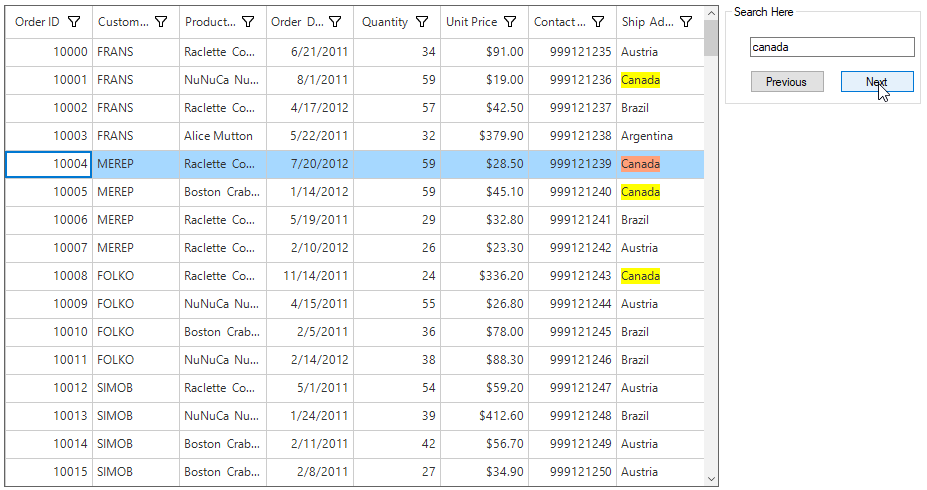

# How to Search and Select Record in WinForms DataGrid?

This example illustrates how to select the record that matches the text typed in a TextBox by using the searching option in the [WinForms DataGrid](https://www.syncfusion.com/winforms-ui-controls/datagrid) (SfDataGrid).

You can search and select a record in DataGrid based on the searched text by using the **TextChanged** event of TextBox by calling [SearchController.Search](https://help.syncfusion.com/cr/windowsforms/Syncfusion.WinForms.DataGrid.SearchController.html#Syncfusion_WinForms_DataGrid_SearchController_Search_System_String_) method.

### C#

``` csharp
private void textBox1_TextChanged(object sender, System.EventArgs e)
{
    this.sfDataGrid.SearchController.Search(this.textBox1.Text);
}
 
private void nextButton_Click(object sender, System.EventArgs e)
{
    this.sfDataGrid.SearchController.FindNext(this.textBox1.Text);
    SetSelectedItem();
}
 
private void previousButton_Click(object sender, System.EventArgs e)
{
    this.sfDataGrid.SearchController.FindPrevious(this.textBox1.Text);
    SetSelectedItem();
}
 
private void SetSelectedItem()
{
    var rowIndex = this.sfDataGrid.SearchController.CurrentRowColumnIndex.RowIndex;
    var recordIndex = this.sfDataGrid.TableControl.ResolveToRecordIndex(rowIndex);
    this.sfDataGrid.SelectedIndex = recordIndex;
}
```

### VB

``` vb
Private Sub textBox1_TextChanged(ByVal sender As Object, ByVal e As System.EventArgs) Handles textBox1.TextChanged
    Me.sfDataGrid.SearchController.Search(Me.textBox1.Text)
End Sub
 
Private Sub nextButton_Click(ByVal sender As Object, ByVal e As System.EventArgs) Handles button1.Click
    Me.sfDataGrid.SearchController.FindNext(Me.textBox1.Text)
    SetSelectedItem()
End Sub
 
Private Sub previousButton_Click(ByVal sender As Object, ByVal e As System.EventArgs) Handles button2.Click
    Me.sfDataGrid.SearchController.FindPrevious(Me.textBox1.Text)
    SetSelectedItem()
End Sub
 
Private Sub SetSelectedItem()
    Dim rowIndex = Me.sfDataGrid.SearchController.CurrentRowColumnIndex.RowIndex
    Dim recordIndex = Me.sfDataGrid.TableControl.ResolveToRecordIndex(rowIndex)
    Me.sfDataGrid.SelectedIndex = recordIndex
End Sub
```



Take a moment to peruse the [WinForms DataGrid - Search](https://help.syncfusion.com/windowsforms/datagrid/search) documentation, where you can find about DataGrid with code examples.